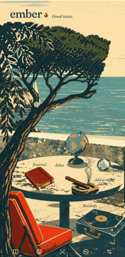
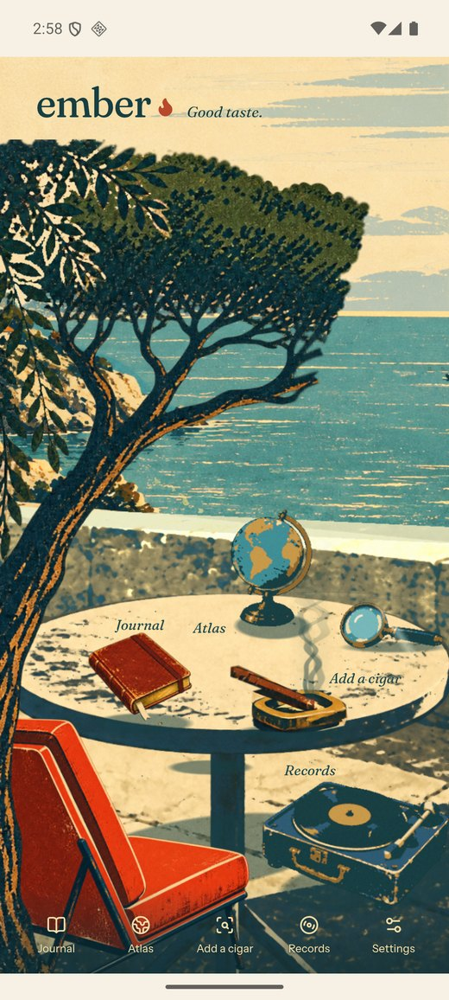
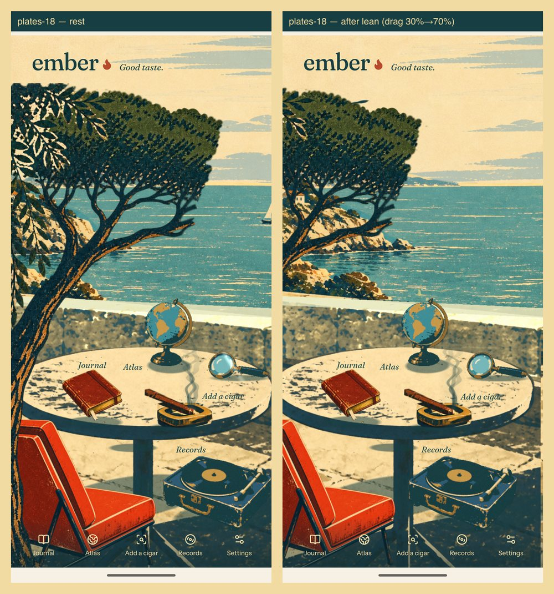
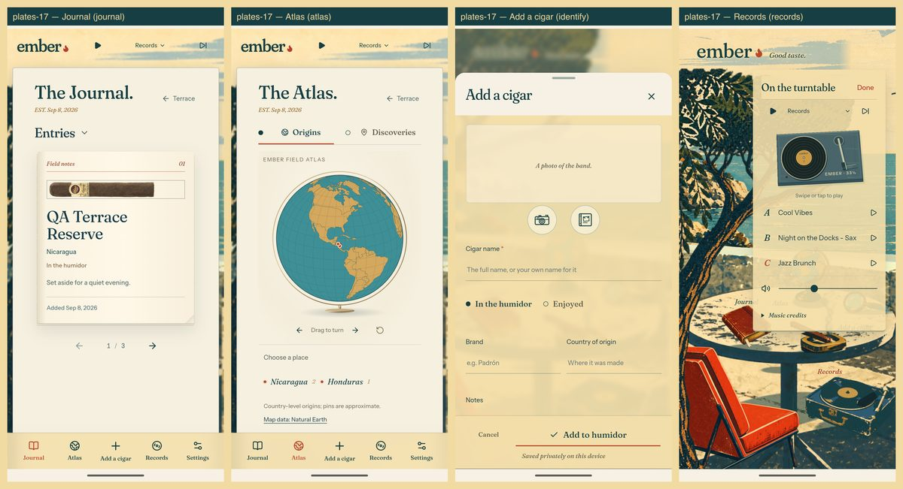

# Ember

A cigar journal for Android whose home screen is a 1960s travel poster you can
lean into. Photograph a cigar, get an identification with sources, keep it in
your humidor with notes and stars, and watch the countries fill in on a globe.

<p align="center">
  
  <br>
  <sub>Recorded on a phone. Every layer is a painting.</sub>
</p>

## The idea

Most apps are a form. A cigar is not a form; it is an hour on a chair. So the
interface is a place: you sit on a terrace, the sea moves, a record plays, and
the objects on the table are the app. Tap the book for the journal, the globe
for the atlas, the magnifier to add a cigar, the turntable for music.

<p align="center">
  
</p>

## How the scene works

It looks flat and it has real depth, because the scene is not one picture.

<p align="center">
  
</p>

The terrace is twelve painted layers and eight sprites, drawn as unlit planes
in [Three.js](https://threejs.org) at real distances from the camera, from the
pine at depth 1.55 to the sky at 40. Nothing is modelled or lit. A manifest
says where each piece sits and how it behaves:

```json
{ "id": "sea", "file": "sea.png", "rect": { "x": 29, "y": 398, "w": 995, "h": 460 },
  "depth": 18, "kind": "sea", "safeEdges": ["top"] }
```

Dragging translates the camera rather than moving the layers, so the parallax
falls out of the geometry for free. `kind` selects behaviour: `static` hangs,
`sea` breathes, `flecks` drift and fade, `drift` scrolls, `breeze` sways from an
anchor, `boat` crosses and turns only while off-screen, `gull` flies left to
right and never mirrors, `prop` is tappable, and `player` has a tone arm that
swings onto a spinning record.

The renderer names no plate file, no scene id and no room, and a test asserts
it. A different room is a different folder of paintings plus a manifest: pass
its path as the `theme` prop on the terrace component, which otherwise defaults
to this one.

The lean is clamped from the manifest itself: each layer reports how much real
paint it has beyond the frame, and the camera is not allowed to travel far
enough to expose an edge.

Details: [architecture](docs/ARCHITECTURE.md) · [art pipeline](docs/ART-PIPELINE.md) · [QA](docs/QA.md)

## The rest of the app

<p align="center">
  
</p>

- **Journal.** Humidor and enjoyed states, stars, notes, dates, purchase place,
  search and filters. Everything is stored on the device. Export and import is a
  JSON file you own.
- **Identification.** The phone sends one photo and an optional band hint to a
  small [Cloudflare Worker](worker/index.ts) you deploy yourself, which calls
  OpenAI and returns a candidate, a confidence, an explanation and source links.
  The API key stays on the Worker; the phone holds only a pairing token,
  encrypted with the Android Keystore. The app abstains when it sees no cigar,
  several cigars, or an unclear photo. See [backend](docs/BACKEND.md).
- **Atlas.** Bundled Natural Earth geography, origins separate from the places
  you found things.
- **Records.** Three bundled CC BY 4.0 recordings, offline, never autoplaying.
  Leaving the app pauses the record; stepping into the app's own camera does
  not, so the music carries through photographing a cigar.

## Build

Node 22.13+, JDK 21, and the Android SDK with platform 36 and build-tools
36.0.0. Set `ANDROID_HOME` and `JAVA_HOME`. The first Gradle run downloads
Gradle itself and the Android plugin, so it needs network access.

The web build runs on Vite through [vinext](https://www.npmjs.com/package/vinext),
which is why there is a `next.config.ts` without Next.js in the dependencies.

```sh
npm ci
npm test            # source tests, no device needed
npm run typecheck
npm run lint
npm run android:apk # -> outputs/Ember-android.apk, debug-signed
```

Rebuild the painted layers from their source art, and the emulator QA run:

```sh
node scripts/plates/build-plates.mjs
node scripts/plates-pilot.mjs <name>   # installs on an AVD named Ember_QA only
```

Full instructions: [building for Android](docs/BUILD-ANDROID.md).

## Status and honesty

This is a personal project, debug-signed, not a Play Store release. It runs on
the author's phone and an isolated emulator. The identification path has been
exercised with real cigars and correctly abstains on non-cigars, but that is
evidence, not a claim of accuracy across all cigars. `store: false` on provider
requests does not override OpenAI's own retention policy. Known rough edges are
listed at the end of [architecture](docs/ARCHITECTURE.md).

Most of the code and all of the painted artwork were produced with AI coding
agents, reviewed and directed by a human, over about a week.

## Licence

Code is MIT, see [LICENSE](LICENSE). That licence covers the code only.

The artwork is not open source: the painted scenes, the poster, the icon and
everything derived from them, wherever they sit in the repository, including
`art/sources`, `public/images`, `public/plates`, `public/icons`, the generated
Android launcher and splash resources, and the screenshots and screen recording
in `docs/images`.
They came out of an image-generation model from written briefs, so how much
copyright subsists is genuinely unsettled; to the extent any does, it is
reserved. The practical ask: read the code, build the app, but please do not
lift the artwork into your own work without asking.

The bundled music is Kevin MacLeod's under CC BY 4.0 with attribution retained, see
[MUSIC-LICENSES.md](MUSIC-LICENSES.md). Other third-party notices, including
the map data and fonts, are in
[THIRD-PARTY-NOTICES.md](THIRD-PARTY-NOTICES.md), and the provenance of every
generated image is in [ASSETS.md](ASSETS.md).
